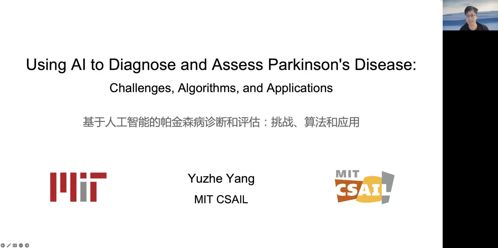
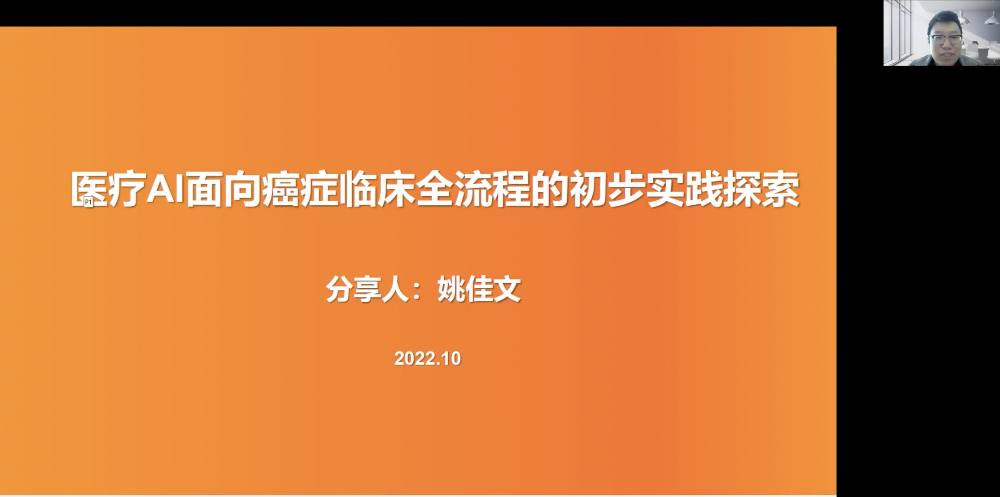

本次论坛由西北工业大学研究生院、自动化学院及脑与人工智能实验室承办，由西北工业大学自动化学院党委书记韩军伟教授、教师张鼎文教授组织。韩军伟教授在致辞中首先介绍了西北工业大学脑与人工智能实验室的渊源，特别强调实验室一直秉持“顶天 立地 育人”的理念，“顶天”即要做国际一流的前沿高水平基础研究，“立地”即要解决实际问题，又要为国家国防做出贡献，“育人”即要培养具有突出创新能力的拔尖人才。韩军伟表示，以“AI+医疗”新星论坛为平台进行学术交流、探讨国际前沿问题，对于贯彻“顶天 立地 育人”理念、鼓励团队创新性研究、推动实验室快速发展、促进青年人才成长等具有重大意义。

来自麻省理工学院的杨宇喆作了题为“通过AI实现利用夜间睡眠呼吸信号的帕金森症的诊断和长期监测”的报告，介绍了帕金森症的研究现状，指出帕金森症的诊断缺乏有效的生物标志物，严重程度无从评估，病情难以跟踪。针对这三项难题，他依次分享了团队的研究工作，介绍了一种人工智能驱动的健康医疗应用，通过AI模型诊断和评估帕金森症，对患者病情进行长期的跟踪。此外，杨宇喆还介绍了他在这项研究中确定并提出的两个实际的继续学习问题——深度不平衡回归问题和多余长尾识别的问题，用于解决现实生活中医疗数据上遇到的困难和挑战。杨宇喆提到，未来还需要更加通用的学习算法，来支持更多现实世界中的医疗诊断，以及其它更具挑战性的问题和任务。在问答环节，杨宇喆以丰富的科研经验和精湛的专业知识，解答了现场专家学者的提问，对“如何从现实问题中抽象出机器学习算法”、“声音信号与生理信号有何区别与联系”、“为何选择夜间睡眠呼吸作为帕金森症标志物”等问题做出详细解答。

来自阿里巴巴达摩院医疗AI实验室的姚佳文博士作了题为“医疗AI面向癌症临床全流程的初步实践与探索”的报告。姚佳文博士首先介绍了国内外的癌症全流程研究进展，指出医疗资源紧张是我国防癌、诊癌、治癌工作的一大痛点，如何在有限的医疗资源对癌症进行高效的全流程管理，使病人受益，是一大难点问题。姚佳文重点分享了团队在该领域取得的工作成果，即医疗AI在癌症全流程-防、诊、治等方面的应用，具体以胰腺为例，展示了如何利用CT影像进行癌症筛查、病人管理以及治疗方案的推荐。姚佳文希望未来能通过AI技术在全流程各阶段实现医疗资源的有效分配，最终延长病人寿命，并与医疗专家和技术一道，推动技术的落地和前瞻性试验。姚佳文还就病理和影像AI技术的差异、癌症愈后评估指标等一些问题，向各位专家学者做出了精彩回答。