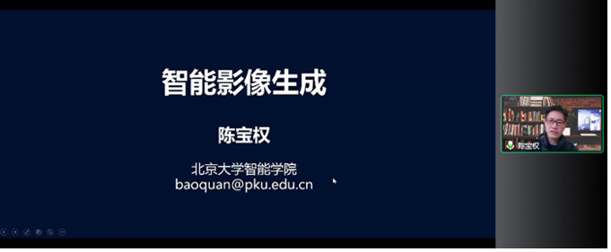
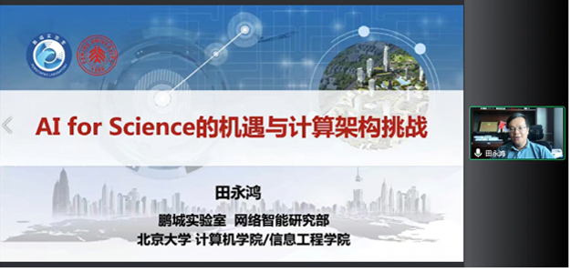
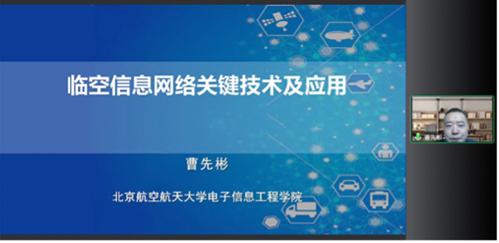
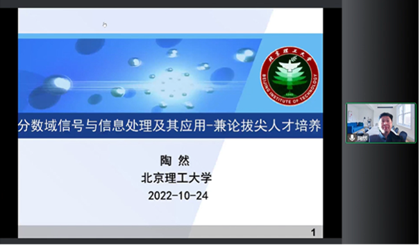

论坛中，北京大学陈宝权教授作了题为“智能影像生成”的报告，介绍了团队在智能影像生成任务上的研究进展和成果，重点分享了团队多项科研成果在2022北京冬奥会上成功应用的范例。

北京大学田永鸿教授作了题为“AI for Science的机遇与计算架构挑战”的报告，介绍了机器学习和智能计算的背景意义和研究进展，并以团队重要研究成果解决相关科学难题进行了说明

北京航空航天大学曹先彬教授作了题为“临空信息网络关键技术及应用”的报告，介绍了临空信息网络的背景意义，分享了团队对临空信息网络系统的研究进展。

北京航空航天大学郭雷教授作了题为“干扰对抗下无人系统仿生智能技术进展与展望”的报告，介绍了无人系统仿生智能的背景应用和重大意义，展示了团队多项重点研究。

北京理工大学陶然教授作了题为“分数域信号与信息处理及其应用-兼论拔尖人才培养”的报告，汇报了团队在分数域信号处理领域的重要理论研究和应用成果，提出要建立“五学通达”的信息研究生高阶学习模式，培养信息类拔尖人才。

本次论坛为与会者呈现了一场精彩的学术交流盛宴，系统展现了智能科学与技术领域的前沿进展，充分激发了大家的兴趣和热情，成功促进了多个学科领域学者之间的跨学科交流，为拓宽和深化智能技术的应用范畴，充分发挥智能新技术的应用价值做出积极贡献。