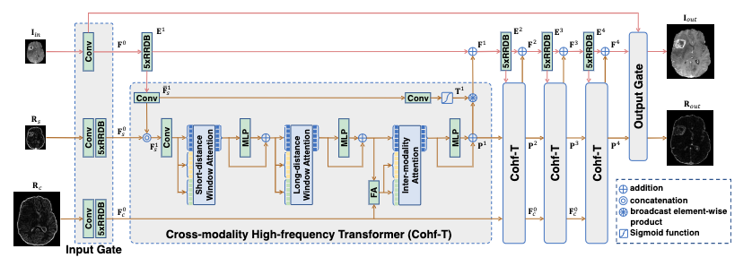

ACM MM 2022 officially released the list of accepted papers. Multiple papers from our team are included.

<!--more-->

## Cross-Modality High-Frequency Transformer for MR Image Super-Resolution

Authors：Chaowei Fang,  [Dingwen Zhang](https://arxiv.org/search/cs?searchtype=author&query=Zhang%2C+D), [Liang Wang](https://arxiv.org/search/cs?searchtype=author&query=Wang%2C+L), [Lechao Cheng](https://arxiv.org/search/cs?searchtype=author&query=Cheng%2C+L), [Junwei Han](https://arxiv.org/search/cs?searchtype=author&query=Han%2C+J)

Improving the resolution of magnetic resonance (MR) image data is critical to computer-aided diagnosis and brain function analysis. Higher resolution helps to capture more detailed content, but typically induces to lower signal-to-noise ratio and longer scanning time. To this end, MR image super-resolution has become a widely-interested topic in recent times. Existing works establish extensive deep models with the conventional architectures based on convolutional neural networks (CNN). In this work, to further advance this research field, we make an early effort to build a Transformer-based MR image super-resolution framework, with careful designs on exploring valuable domain prior knowledge. Specifically, we consider two-fold domain priors including the high-frequency structure prior and the inter-modality context prior, and establish a novel Transformer architecture, called Cross-modality high-frequency Transformer (Cohf-T), to introduce such priors into super-resolving the low-resolution (LR) MR images. Comprehensive experiments on two datasets indicate that Cohf-T achieves new state-of-the-art performance.